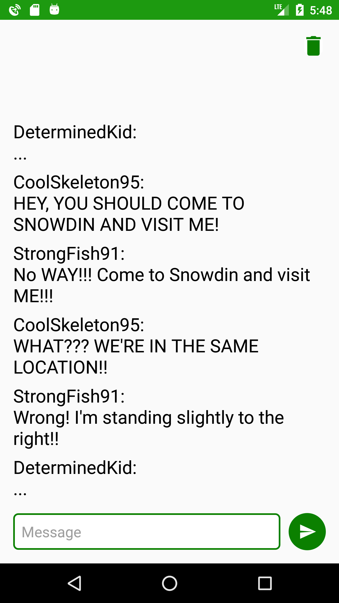
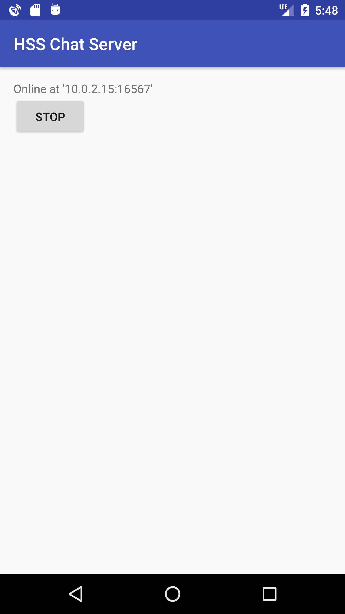

# 💬 HssChat
Chat client and server for Android

 

## ⚡ Deployment

These instructions will get you a release of this project up and running on your local machine, so that you can start using it.

### 📋 Prerequisites

* [Android 4.0.3+](https://developer.android.com/about/versions/android-4.0.3.html)

### 🚀 Getting Started

Just copy over the apk of the client and/or server and install it.

## 🛠️ Development

These instructions will get you a copy of this project up and running on your local machine for development and testing purposes.

### 📋 Prerequisites

* [Android Studio](https://developer.android.com/studio/index.html) - The Official IDE for Android

### 🚀 Getting Started

To use the PC Client, you need to add a Run Configuration of type `Application` with the following details:

* Name: `client_pc`
* Main class: `de.hss.sae.sue.chat.client_pc.PcClient`
* Program arguments: `<server-address>:<server-port>`
* Use classpath of module: `client_pc`

### 🐞 Troubleshooting

#### Q: How do I get the app to run? It just opens the "Edit configuration" dialog with "Error: Please select Android SDK". 
Just sync gradle by clicking  in the toolbar and it should work.

## 👨‍💻 Authors

* **Alexander Berndt**
  * *Client - Design, Interface*
* **Robin Hartmann** - [robin-hartmann](https://github.com/robin-hartmann)
  * *Client - Communication, Threading*
  * *Server*
  * *PC Client*
* **Kevin Landsberg** - [KevinLandsberg](https://github.com/KevinLandsberg)
  * *Client - Design, Interface*
* **Frederik Ried**
  * *Client - Local Strorage, Database*

## 📃 License

This project is licensed under the MIT License - see the [LICENSE](LICENSE) file for details.

## 👍 Acknowledgments

* Special thanks to Alex, [Kevin](https://github.com/KevinLandsberg) and Freddy for letting me publish this project
